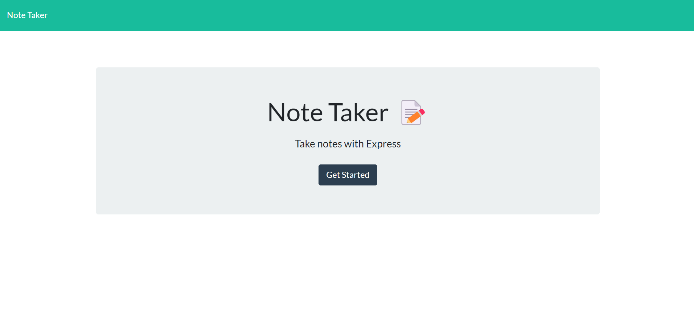
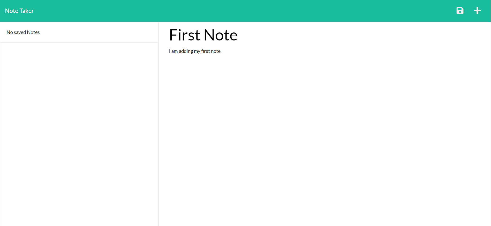
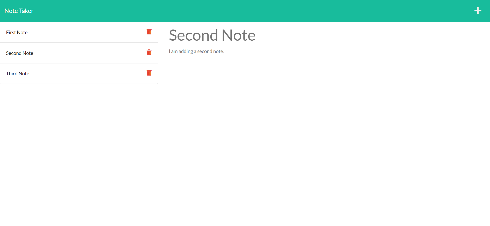

# Note Taker

## Description

This app can be used to write and save notes, so that user can organize their thoughts and keep track of tasks they need to complete.

  ## Table of Contents
  - [Installation](#installation)
  - [Features](#features)
  - [Screenshots](#screenshots)
  - [Deployment](#deployment)
  - [Questions](#questions)

## Features

```
- When started, a landing page is presented with a link to a notes page
- The notes page is presented with xisting notes listed in the left-hand column, plus empty fields to enter a new note title and the note’s text in the right-hand column
- WHEN user enter a new note title and the note’s text, a Save icon appears in the navigation at the top of the page that they can be able to click on to save new notes.
- WHEN user click on an existing note in the list in the left-hand column, that note appears in the right-hand column
- WHEN use eclick on the Write icon in the navigation at the top of the page, they will be presented with empty fields to enter a new note title and the note’s text in the right-hand column
- User can also delete saved notes by clicking on the DELETE icon sitting next to that note.
```

## Screenshots:







## Deployment

You can access to deployed application on:
- [Note-Taker-Heroku](https://w11c-notes-taker.herokuapp.com/)

Or access to GitHub repository on:
- [Note-Taker-GitHub](https://github.com/odthientho/w11c-note-taker)


## Questions
If you have any questions about the repo, open an issue or contact me directly at odthientho@gmail.com. You can find more of my works at [odthientho](https://github.com/odthientho/)